# PayrollMaster 变量命名映射关系文档

## 📋 概述

本文档详细说明了 PayrollMaster 项目中**7种命名规范**之间的映射关系，确保数据在不同层面之间的一致性和正确转换。

---

## 🎯 七种命名规范总览

| 序号 | 命名规范 | 命名风格 | 使用场景 | 示例 |
|------|----------|----------|----------|------|
| 1️⃣ | **数据库字段** | snake_case | 数据库表、列、索引 | `employee_id`, `base_salary` |
| 2️⃣ | **API响应** | camelCase | JSON数据传输 | `employeeId`, `baseSalary` |
| 3️⃣ | **后端Python** | snake_case | 函数、变量、类方法 | `calculate_payroll`, `employee_id` |
| 4️⃣ | **前端TypeScript** | camelCase | React组件、状态管理 | `employeeId`, `baseSalary` |
| 5️⃣ | **Excel字段** | camelCase | 导入/导出文件 | `employeeId`, `bankAccount` |
| 6️⃣ | **OpenAPI规范** | camelCase | API文档、Swagger | `employeeId`, `baseSalary` |
| 7️⃣ | **外键引用** | PascalCase | 数据库外键字段 | `employeeId` (引用`Employee.id`) |

---

## 🔄 完整字段映射表

### 员工相关字段

| 数据库字段 | API/JSON | Python代码 | 前端TS | Excel字段 | OpenAPI | 外键 |
|------------|----------|------------|--------|-----------|---------|------|
| `employee_id` | `employeeId` | `employee_id` | `employeeId` | `employeeId` | `employeeId` | `employeeId` |
| `employee_name` | `employeeName` | `employee_name` | `employeeName` | `employeeName` | `employeeName` | - |
| `id_card_number` | `idCardNumber` | `id_card_number` | `idCardNumber` | `idCardNumber` | `idCardNumber` | - |
| `department_id` | `departmentId` | `department_id` | `departmentId` | `departmentId` | `departmentId` | `departmentId` |
| `department_name` | `departmentName` | `department_name` | `departmentName` | `departmentName` | `departmentName` | - |
| `hire_date` | `hireDate` | `hire_date` | `hireDate` | `hireDate` | `hireDate` | - |
| `bank_account` | `bankAccount` | `bank_account` | `bankAccount` | `bankAccount` | `bankAccount` | - |
| `role` | `role` | `role` | `role` | `role` | `role` | - |
| `created_at` | `createdAt` | `created_at` | `createdAt` | `createdAt` | `createdAt` | - |
| `updated_at` | `updatedAt` | `updated_at` | `updatedAt` | `updatedAt` | `updatedAt` | - |

### 薪资相关字段

| 数据库字段 | API/JSON | Python代码 | 前端TS | Excel字段 | OpenAPI | 外键 |
|------------|----------|------------|--------|-----------|---------|------|
| `base_salary` | `baseSalary` | `base_salary` | `baseSalary` | `baseSalary` | `baseSalary` | - |
| `position_salary_base` | `positionSalaryBase` | `position_salary_base` | `positionSalaryBase` | `positionSalaryBase` | `positionSalaryBase` | - |
| `gross_pay` | `grossPay` | `gross_pay` | `grossPay` | `grossPay` | `grossPay` | - |
| `net_pay` | `netPay` | `net_pay` | `netPay` | `netPay` | `netPay` | - |
| `personal_income_tax` | `personalIncomeTax` | `personal_income_tax` | `personalIncomeTax` | `personalIncomeTax` | `personalIncomeTax` | - |
| `calculation_date` | `calculationDate` | `calculation_date` | `calculationDate` | `calculationDate` | `calculationDate` | - |
| `performance_bonus` | `performanceBonus` | `performance_bonus` | `performanceBonus` | `performanceBonus` | `performanceBonus` | - |
| `overtime_pay` | `overtimePay` | `overtime_pay` | `overtimePay` | `overtimePay` | `overtimePay` | - |

### 考勤相关字段

| 数据库字段 | API/JSON | Python代码 | 前端TS | Excel字段 | OpenAPI | 外键 |
|------------|----------|------------|--------|-----------|---------|------|
| `attendance_days` | `attendanceDays` | `attendance_days` | `attendanceDays` | `attendanceDays` | `attendanceDays` | - |
| `sick_leave_days` | `sickLeaveDays` | `sick_leave_days` | `sickLeaveDays` | `sickLeaveDays` | `sickLeaveDays` | - |
| `personal_leave_days` | `personalLeaveDays` | `personal_leave_days` | `personalLeaveDays` | `personalLeaveDays` | `personalLeaveDays` | - |
| `system_work_days` | `systemWorkDays` | `system_work_days` | `systemWorkDays` | `systemWorkDays` | `systemWorkDays` | - |
| `business_trip_days` | `businessTripDays` | `business_trip_days` | `businessTripDays` | `businessTripDays` | `businessTripDays` | - |
| `training_days` | `trainingDays` | `training_days` | `trainingDays` | `trainingDays` | `trainingDays` | - |

### 角色字段映射

| 数据库角色值 | API/JSON | Python代码 | 前端TS | 说明 |
|------------|----------|------------|--------|------|
| `admin` | `admin` | `admin` | `admin` | 系统管理员 |
| `staff_admin` | `staffAdmin` | `staff_admin` | `staffAdmin` | 职工调配管理员 |
| `attendance` | `attendance` | `attendance` | `attendance` | 职工考勤管理员 |
| `security` | `security` | `security` | `security` | 社保管理员 |
| `finance` | `finance` | `finance` | `finance` | 财务管理员 |
| `payroll` | `payroll` | `payroll` | `payroll` | 单位薪资核算员 |
| `employee` | `employee` | `employee` | `employee` | 普通员工 |

---

## 🔄 数据转换流程

### 1. Excel → 数据库存储

```mermaid
graph LR
    A[Excel字段] --> B[API接收]
    B --> C[Python处理]
    C --> D[数据库存储]
```



**转换步骤**：
```python
# 1. Excel读取 (camelCase)
excel_data = {
    "employeeId": "RYJM-0000137269",
    "baseSalary": 8000,
    "hireDate": "2020-01-15"
}

# 2. API接收 (保持camelCase)
@router.post("/employees")
async def create_employee(data: EmployeeCreate):
    employee_id = data.employeeId
    base_salary = data.baseSalary

# 3. 数据库存储 (转换为snake_case)
db_employee = Employee(
    employee_id=employee_id,  # camelCase → snake_case
    base_salary=base_salary,
    hire_date=data.hireDate
)
```

### 2. 数据库 → API响应

```python
# 数据库查询 (snake_case)
db_employee = session.query(Employee).first()

# 转换为API响应 (camelCase)
api_response = EmployeeResponse(
    employeeId=db_employee.employee_id,
    employeeName=db_employee.employee_name,
    baseSalary=db_employee.base_salary,
    hireDate=db_employee.hire_date,
    createdAt=db_employee.created_at,
    updatedAt=db_employee.updated_at
)

# 返回JSON (camelCase)
return api_response
```

### 3. 前端组件使用

```typescript
// TypeScript类型定义
interface Employee {
    employeeId: string;
    employeeName: string;
    baseSalary: number;
    hireDate: string;
    createdAt: string;
    updatedAt: string;
}

// React组件使用
const EmployeeCard: React.FC<{ employee: Employee }> = ({ employee }) => {
    return (
        <div>
            <h3>{employee.employeeName}</h3>
            <p>工号: {employee.employeeId}</p>
            <p>薪资: {employee.baseSalary}</p>
            <p>入职日期: {employee.hireDate}</p>
        </div>
    );
};
```

---

## 📊 外键关系映射

### 数据库表结构示例

```sql
-- Employee 表
CREATE TABLE employee (
    id SERIAL PRIMARY KEY,           -- 自增主键
    employee_id VARCHAR(20) UNIQUE,  -- 员工编码
    employee_name VARCHAR(100),
    department_id INTEGER,
    base_salary DECIMAL(10,2),
    hire_date DATE,
    created_at TIMESTAMP,
    updated_at TIMESTAMP
);

-- AttendanceRecord 表
CREATE TABLE attendance_record (
    id SERIAL PRIMARY KEY,
    employeeId INTEGER REFERENCES employee(id),  -- 外键引用employee.id
    date DATE,
    status VARCHAR(20),
    created_at TIMESTAMP
);

-- PayrollRecord 表
CREATE TABLE payroll_record (
    id SERIAL PRIMARY KEY,
    employeeId INTEGER REFERENCES employee(id),  -- 外键引用employee.id
    payroll_month VARCHAR(7),
    base_salary DECIMAL(10,2),
    gross_pay DECIMAL(10,2),
    net_pay DECIMAL(10,2),
    created_at TIMESTAMP
);
```

### 外键查询示例

```python
# 通过 employee_id 查询考勤记录
employee_id = "RYJM-0000137269"

# 1. 找到员工 (使用 employee_id 字段)
employee = session.query(Employee).filter(
    Employee.employee_id == employee_id
).first()

# 2. 使用 employee.id 作为外键查询考勤
if employee:
    attendance_records = session.query(AttendanceRecord).filter(
        AttendanceRecord.employee_id == employee.id  # 使用employee.id
    ).all()

# 3. 返回API响应 (转换为camelCase)
result = {
    "employeeId": employee.employee_id,
    "attendances": [
        {
            "employeeId": record.employee_id,  # 外键字段
            "date": record.date,
            "status": record.status
        }
        for record in attendance_records
    ]
}
```

---

## 🛠️ 命名转换工具函数

### Python 转换函数

```python
def snake_to_camel(snake_str: str) -> str:
    """snake_case → camelCase"""
    components = snake_str.split('_')
    return components[0] + ''.join(x.title() for x in components[1:])

def camel_to_snake(camel_str: str) -> str:
    """camelCase → snake_case"""
    import re
    s1 = re.sub('(.)([A-Z][a-z]+)', r'\1_\2', camel_str)
    return re.sub('([a-z0-9])([A-Z])', r'\1_\2', s1).lower()

# 使用示例
snake_to_camel("employee_id")  # → "employeeId"
camel_to_snake("employeeId")   # → "employee_id"
```

### TypeScript 转换函数

```typescript
function snakeToCamel(snakeStr: string): string {
    return snakeStr.replace(/_([a-z])/g, (_, letter) => letter.toUpperCase());
}

function camelToSnake(camelStr: string): string {
    return camelStr.replace(/[A-Z]/g, letter => `_${letter.toLowerCase()}`);
}

// 使用示例
snakeToCamel("employee_id");  // → "employeeId"
camelToSnake("employeeId");   // → "employee_id"
```

---

## 📝 验证规则

### 各层命名规则检查

| 层级 | 规则 | 正则表达式 | 示例 |
|------|------|------------|------|
| **数据库** | snake_case | `^[a-z][a-z0-9_]*$` | `employee_id`, `base_salary` |
| **API/JSON** | camelCase | `^[a-z][a-zA-Z0-9]*$` | `employeeId`, `baseSalary` |
| **Python代码** | snake_case | `^[a-z][a-z0-9_]*$` | `calculate_payroll`, `employee_id` |
| **前端TS** | camelCase | `^[a-z][a-zA-Z0-9]*$` | `employeeId`, `baseSalary` |
| **Excel字段** | camelCase | `^[a-z][a-zA-Z0-9]*$` | `employeeId`, `bankAccount` |
| **外键** | PascalCase | `^[A-Z][a-zA-Z0-9]*Id$` | `employeeId`, `departmentId` |

---

## 🎨 IDE 配置

### VS Code 配置 (.vscode/settings.json)

```json
{
  "editor.tokenColorCustomizations": {
    "[*]": {
      "textMateRules": [
        {
          "name": "Database fields (snake_case)",
          "match": "\\b[a-z_]+(?:_[a-z_]+)*\\b",
          "foreground": "#e06c75"
        },
        {
          "name": "API/Code fields (camelCase)",
          "match": "\\b[a-zA-Z]+(?:[A-Z][a-z]*)*\\b",
          "foreground": "#98c379"
        },
        {
          "name": "Foreign keys (PascalCase+Id)",
          "match": "\\b[A-Z][a-zA-Z]*Id\\b",
          "foreground": "#61afef"
        }
      ]
    }
  }
}
```

### Pylint 配置 (.pylintrc)

```ini
[FORMAT]
# 允许蛇形命名（数据库字段）
good-names=i,j,k,ex,Run,_,employee_id,base_salary,created_at

# 强制驼峰命名（业务逻辑）
good-names=i,j,k,ex,Run,_,employeeId,baseSalary,calculatePayroll

# 禁止的命名
bad-names=foo,bar,baz
```

---

## ⚡ 快速参考表

### 转换速查

| 从 | 到 | 转换规则 | 示例 |
|----|----|----------|------|
| snake_case | camelCase | 首字母小写，后续每个下划线后的首字母大写，删除下划线 | `employee_id` → `employeeId` |
| camelCase | snake_case | 每个大写字母前加下划线，全部转小写 | `employeeId` → `employee_id` |
| PascalCase | camelCase | 首字母小写 | `EmployeeId` → `employeeId` |
| camelCase | PascalCase | 首字母大写 | `employeeId` → `EmployeeId` |

### 常见错误对照

| ❌ 错误写法 | ✅ 正确写法 | 原因 |
|------------|------------|------|
| `employee_id` (API) | `employeeId` | API应使用camelCase |
| `employeeId` (数据库) | `employee_id` | 数据库应使用snake_case |
| `employeeId` (Python变量) | `employee_id` | Python代码应使用snake_case |
| `employeeId` (Excel) | `employeeId` | Excel字段名已定义 |
| `employeecode` | `employee_id` | 应使用snake_case或camelCase |
| `staff-admin` (数据库) | `staff_admin` | 数据库应使用snake_case |
| `staffAdmin` (Python) | `staff_admin` | Python代码应使用snake_case |

---

## 📚 相关文档

- [项目编码规范](./guides/coding-standards.md) - 完整的命名规范说明
- [Python编码规范](./guides/python-standards.md) - Python代码命名规则
- [Excel格式规范](./guides/excel-format.md) - Excel字段定义
- [数据模型设计](./model.md) - 数据库结构设计
- [API接口文档](./contracts/api.md) - API契约定义

---

## ✅ 检查清单

### 开发前检查
- [ ] 确认使用的命名规范符合层级要求
- [ ] 数据库字段使用 snake_case
- [ ] API/JSON响应使用 camelCase
- [ ] Python代码使用 snake_case
- [ ] 前端代码使用 camelCase
- [ ] Excel字段使用定义的 camelCase
- [ ] 外键字段使用 PascalCase + Id
- [ ] 角色名称符合各层命名规范

### 代码审查检查
- [ ] 字段命名与映射表一致
- [ ] 数据转换逻辑正确
- [ ] 上下文字段名统一
- [ ] 注释标明使用的命名规范

---

**记住**：统一的命名规范是保证代码质量和可维护性的基础！🎯